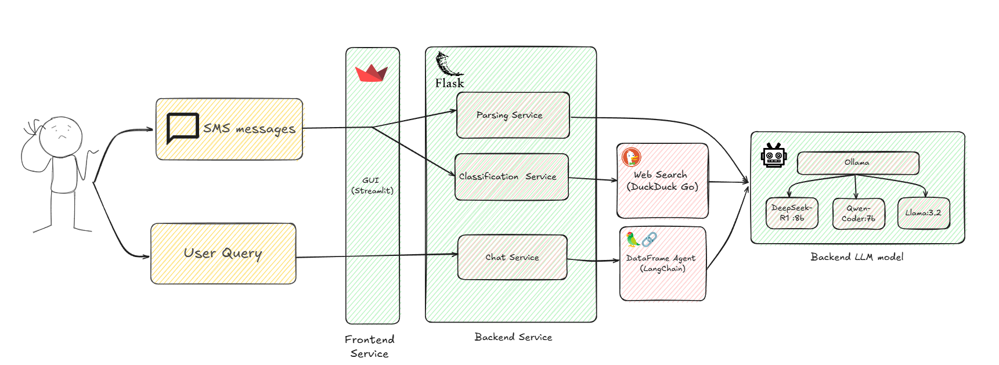
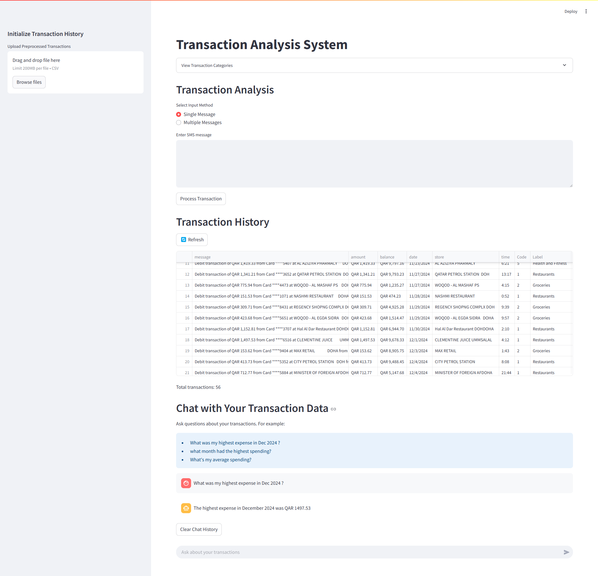

# Transaction Analysis System

A comprehensive system for analyzing financial transactions using Natural Language Processing (NER), Classification, and Interactive Chat capabilities. The system processes SMS-style transaction messages and categorizes them while providing analytical insights.





## Features

- **Named Entity Recognition (NER)**
  - Extracts key transaction details like amount, store, date, time, and balance
  - Powered by Ollama LLM for accurate entity extraction

- **Transaction Classification**
  - Automatically categorizes transactions into predefined categories
  - Categories include:
    - Restaurants
    - Groceries
    - Transportation
    - Donations and Gifts
    - Health and Fitness
    - Fees and Subscriptions
  - Uses web search enrichment for better classification accuracy

- **Interactive Chat Interface**
  - Ask questions about your transaction history
  - Natural language query processing
  - Provides analytical insights and summaries
  - Powered by LangChain with Pandas DataFrame Agent

- **Transaction History Management**
  - CSV-based transaction storage
  - Upload and initialize transaction history
  - View and manage historical transactions
  - Real-time transaction processing


### Frontend
- Built with Streamlit
- Interactive UI for transaction processing
- Real-time chat interface
- Transaction history visualization

### Backend
- Flask-based REST API
- Modular service architecture
- Integration with Ollama LLM
- DuckDuckGo search integration for store enrichment

## Running with Docker Compose

The easiest way to run the application is using Docker Compose:

1. **Build and Start the Services**
```bash
docker compose build
docker compose up -d
```

2- Download Ollama model, make sure you use the same model name as stated in `config/app_config.py`. Default value is `qwen2.5-coder:7b`
```bash
docker compose exec -it ollama ollama pull qwen2.5-coder:7b
```
3- Load ollama model in memeory, you can use /exit once the model is loaded.

```bash
docker compose exec -it ollama ollama run qwen2.5-coder:7b
```

4. **Access the Application**
- Frontend: http://localhost:8501
- Backend API: http://localhost:5000

5. **Stop the Services**
```bash
docker-compose down
```

# Running ollama on Docker with CPU only 
To run the application only with cpu comment the following secion in the docker compose 
```docker compose
  ollama:
    image: ollama/ollama:latest
    container_name: backend-ollama
    ports:
      - "11434:11434"
    volumes:
      - ./data/models:/root/.ollama
    networks:
      - genai-network
    # deploy:
    # resources:
    #    reservations:
    #      devices:
    #        - driver: nvidia
    #          count: all
    #          capabilities: [gpu] 
```


## Running Locally

1. **Install Ollama**
   - Visit [Ollama's website](https://ollama.ai) to download and install Ollama for your operating system
   - After installation, pull the required model:
   ```bash
   ollama pull qwen2.5-coder:7b
   ```
   Other models can also be used such as mistral:7b, llama2:7b, codellama:7b, deepseek:8b, llama3.1, and llama3.2, but qwen2.5-coder:7b performed the best in my limited testing

2. **Install Dependencies**
```bash
pip install -r requirements.txt
```

3. **Running the Application**

Backend:
```bash
cd backend
python run.py
```

Frontend:
```bash
cd frontend
streamlit run app.py
```

3. **Update the configuration**
The config file `config/app_config.py` contains configurations for running in Docker by default. To run locally, update the following configurations:

4. **Configuration**
The application can be configured through environment variables or the config file. Here are the main configuration options:

| Configuration | Description | Default Value |
|--------------|-------------|---------------|
| SERVER_HOST | Backend server host address | localhost |
| SERVER_PORT | Backend server port | 5000 |
| LLM_NAME | Name/model of Ollama LLM to use | qwen2.5-coder:7b |
| OLLAMA_URL | URL for Ollama API endpoint | http://localhost:11434/api/generate |
| DATA_PATH | Path to data storage directory | ../data |
| CSV_FILENAME | Name of transaction data file | app_data.csv |
| API_BASE_URL | Base URL for API endpoints | http://SERVER_HOST:SERVER_PORT |
| NER_ENDPOINT | Endpoint for entity recognition | API_BASE_URL/ner |
| CLASSIFICATION_ENDPOINT | Endpoint for transaction classification | API_BASE_URL/classify |
| CHAT_ENDPOINT | Endpoint for chat interface | API_BASE_URL/chat |

These configurations can be modified in `config/app_config.py`.


## API Endpoints

- `/ner` - Named Entity Recognition
- `/classify` - Transaction Classification
- `/chat` - Chat Interface

## Data Structure

Transactions are stored in CSV format with the following fields:
- Message
- Amount
- Store
- Account
- Balance
- Date
- Time
- Category
- Classification Code

## Dependencies

- Python 3.10+
- Streamlit
- Flask
- Langchain
- Ollama
- Pandas
- DuckDuckGo Search

## Project Structure

```
.
├── backend/
│   ├── app/
│   │   ├── api/
│   │   ├── services/
│   │   └── core/
│   └── run.py
├── frontend/
│   ├── src/
│   │   ├── config.py
│   │   ├── services.py
│   │   └── utils.py
│   └── app.py
└── data/
```

## System Screenshots



## To Do


- [x] ~~Containerize application~~ :
  - [x] ~~Create Dockerfile for backend service~~
  - [x] ~~Create Dockerfile for frontend service~~
  - [x] ~~Set up Docker Compose for multi-container deployment~~

- [ ] Add support for cloud-based LLM providers:
  - [ ] OpenAI GPT models integration
  - [ ] Azure OpenAI integration
  - [ ] HuggingFace models integration

- [ ] Develop custom ML models:
  - [ ] Train specialized NER model on financial transaction data
  - [ ] Create custom classification model for transaction categorization
  - [ ] Implement embeddings for semantic search capabilities


## Authors

Hussein Aly
